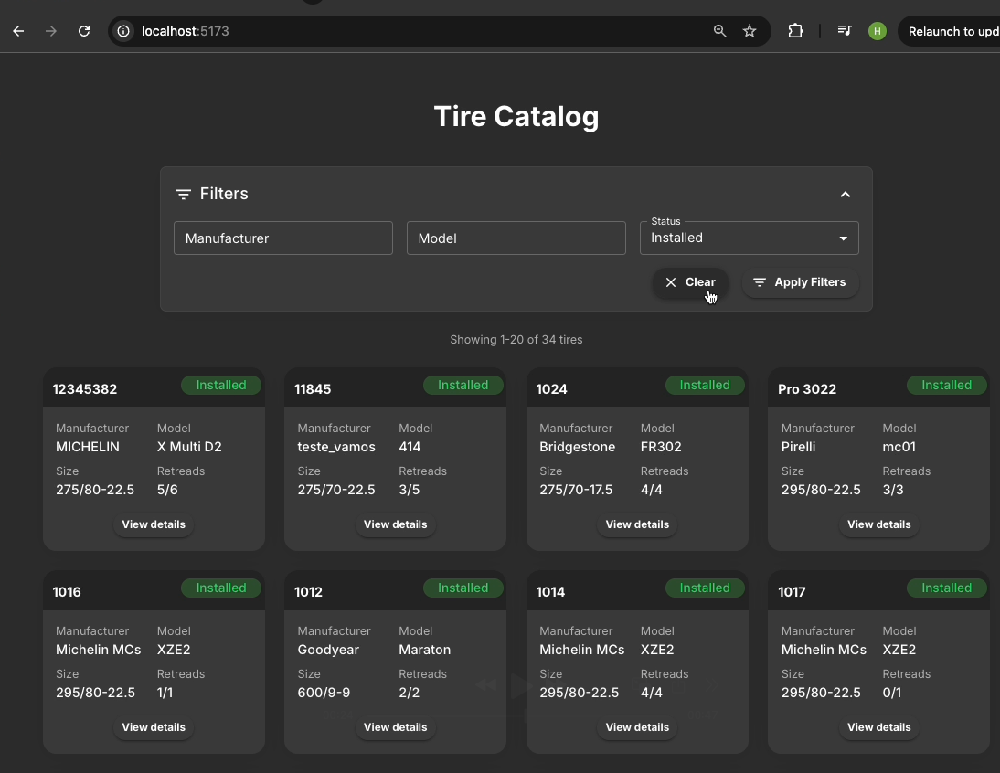
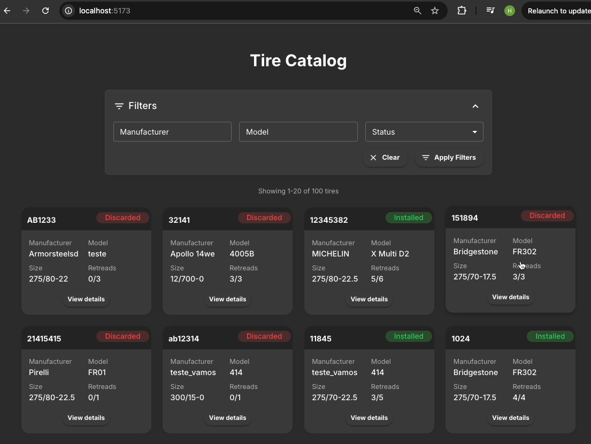
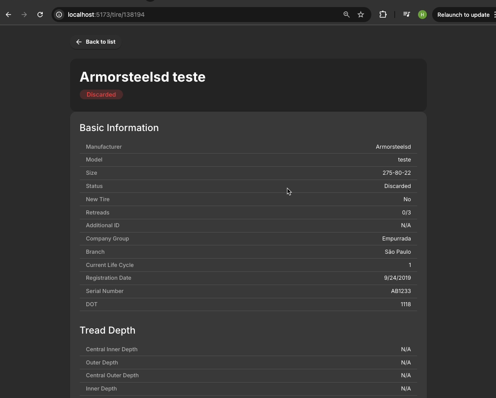

# Find My Tire - Catálogo de Pneus

Um sistema de gerenciamento de pneus para frotas, desenvolvido como parte de um teste técnico para uma vaga de Desenvolvedor Frontend.

## Escopo do Projeto

Aplicação web para gerenciamento e visualização de pneus de uma frota, permitindo:

- Visualização de todos os pneus cadastrados
- Filtragem por diversos parâmetros
- Visualização detalhada de cada pneu
- Interface responsiva e intuitiva

> **Nota:** o projeto possui um backend, mas ele existe apenas para manter o token da API seguro. O backend não processa dados de pneus, apenas serve como proxy seguro para o frontend acessar a API externa.

## Funcionalidades

- **Listagem de Pneus**: Visualização em grid com informações resumidas
- **Filtragem Avançada**: Por fabricante, modelo e status
- **Detalhes do Pneu**: Visualização completa das informações técnicas
- **Paginação**: Navegação eficiente por grandes conjuntos de dados
- **Navegação Intuitiva**: Interface amigável com feedback visual

## Tecnologias Utilizadas

- **React 19**: Biblioteca para construção de interfaces
- **TypeScript 5**: Superset tipado de JavaScript
- **Material UI 5**: Framework de componentes para React
- **Zustand 4**: Gerenciamento de estado global
- **Axios 1.4**: Cliente HTTP para requisições à API
- **React Router 6**: Roteamento da aplicação
- **Vite 4**: Ferramenta de build e desenvolvimento
- **.NET 9.0**: Backend seguro para proxy de API

## Ferramentas de Desenvolvimento

- **Jest 29**: Framework de testes
- **Testing Library**: Utilitários para testes de componentes React
- **Cypress 12**: Framework para testes end-to-end
- **ESLint 8**: Linter para identificar problemas no código
- **Prettier 2**: Formatador de código
- **Husky 8**: Automatização de hooks do Git

## Estrutura de Pastas

```
src/
├── __tests__/       # Testes unitários
├── components/      # Componentes reutilizáveis
├── config/          # Configurações da aplicação
├── hooks/           # Hooks personalizados
├── pages/           # Páginas/rotas da aplicação
├── services/        # Serviços de comunicação com API
├── store/           # Gerenciamento de estado global
├── types/           # Definições de tipos TypeScript
├── utils/           # Funções utilitárias
├── App.tsx          # Componente principal
└── main.tsx         # Ponto de entrada da aplicação
```

## Como executar o projeto

### Backend (.NET)

1. Navegue até a pasta `backend`
2. Instale as dependências se necessário
3. Execute o projeto com:
   ```bash
   dotnet run
   ```
4. O backend estará disponível em `http://localhost:5016`

### Frontend (React)

1. Navegue até a pasta `frontend`
2. Instale as dependências com:
   ```bash
   npm install
   ```
3. Execute o projeto com:
   ```bash
   npm run dev
   ```
4. O frontend estará disponível em `http://localhost:5173`

> **Importante:** Tanto o backend quanto o frontend devem estar rodando para que a aplicação funcione corretamente.

## Instruções para testes

Execute os testes com `npm test`

### Executando testes específicos

Para executar um arquivo de teste específico:

```bash
npm test -- src/__tests__/nome-do-arquivo.test.ts   
```

### Executando testes com cobertura

Para executar os testes com cobertura:

```bash
npm test -- --coverage
``` 
O relatório de cobertura será gerado na pasta `coverage/`.

### Estrutura de testes

O projeto utiliza Jest para testes unitários:

- `src/__tests__/tireService.test.ts`: Testes para o serviço de pneus
- `src/__tests__/tireStore.test.ts`: Testes para a store de pneus

### Abordagem de testes

Os testes unitários utilizam mocks para isolar as unidades testadas de suas dependências externas, garantindo testes rápidos e confiáveis.

## Testes End-to-End com Cypress

### Executando os Testes Cypress

1. **Instale as dependências** (se ainda não fez):
   ```bash
   cd frontend
   npm install
   ```

2. **Inicie a aplicação** (backend e frontend devem estar rodando):
   ```bash
   # Em um terminal
   cd backend
   dotnet run

   # Em outro terminal
   cd frontend
   npm run dev
   ```

3. **Execute o Cypress em modo interativo**:
   ```bash
   npx cypress open
   ```
   - Isso abrirá a interface do Cypress Test Runner. Selecione um teste para rodar no navegador.

4. **Execute o Cypress em modo headless** (para CI ou verificações rápidas):
   ```bash
   npx cypress run
   ```

### Arquivos de Teste Cypress

- Todos os testes Cypress estão localizados em `frontend/cypress/e2e/`.
- Exemplos de arquivos de teste:
  - `basic.cy.ts`: Teste básico de carregamento da aplicação
  - `filters.cy.ts`: Testes de filtros de pneus
  - `tire-details.cy.ts`: Testes da página de detalhes do pneu

### Observações

- Certifique-se de que tanto o backend quanto o frontend estejam rodando antes de executar os testes Cypress.
- Você pode adicionar ou modificar testes no diretório `frontend/cypress/e2e/`.

---

# Find My Tire - Tire Catalog

A fleet tire management system, developed as part of a technical test for a Frontend Developer position.

## Project Scope

Web application for managing and viewing fleet tires, allowing:

- View all registered tires
- Filter by various parameters
- Detailed view of each tire
- Responsive and intuitive interface

> **Note:** the project has a backend, but it exists only to keep the API token safe. The backend does not process tire data, it just serves as a secure proxy for the frontend to access the external API.

## Features

- **Tire Listing**: Grid view with summarized information
- **Advanced Filtering**: By manufacturer, model, and status
- **Tire Details**: Complete view of technical information
- **Pagination**: Efficient navigation through large datasets
- **Intuitive Navigation**: User-friendly interface with visual feedback

## Technologies Used

- **React 19**: Library for building interfaces
- **TypeScript 5**: Typed JavaScript superset
- **Material UI 5**: Component framework for React
- **Zustand 4**: Global state management
- **Axios 1.4**: HTTP client for API requests
- **React Router 6**: Application routing
- **Vite 4**: Build and development tool
- **.NET 9.0**: Secure backend for API proxy

## Development Tools

- **Jest 29**: Testing framework
- **Testing Library**: Utilities for React component testing
- **Cypress 12**: End-to-end testing framework
- **ESLint 8**: Code linter
- **Prettier 2**: Code formatter
- **Husky 8**: Git hooks automation

## Folder Structure

```
src/
├── __tests__/       # Unit tests
├── components/      # Reusable components
├── config/          # Application configuration
├── hooks/           # Custom hooks
├── pages/           # Application pages/routes
├── services/        # API communication services
├── store/           # Global state management
├── types/           # TypeScript type definitions
├── utils/           # Utility functions
├── App.tsx          # Main component
└── main.tsx         # Application entry point
```

## How to run the project

### Backend (.NET)

1. Navigate to the `backend` folder
2. Install dependencies if needed
3. Run the project with:
   ```bash
   dotnet run
   ```
4. The backend will be available at `http://localhost:5016`

### Frontend (React)

1. Navigate to the `frontend` folder
2. Install dependencies with:
   ```bash
   npm install
   ```
3. Run the project with:
   ```bash
   npm run dev
   ```
4. The frontend will be available at `http://localhost:5173`

> **Important:** Both backend and frontend services must be running for the application to work properly.

## Testing Instructions

Run tests with `npm test`

### Running Specific Tests

To run a specific test file:

```bash
npm test -- src/__tests__/filename.test.ts   
```

### Running Tests with Coverage

To run tests with coverage:

```bash
npm test -- --coverage
``` 
The coverage report will be generated in the `coverage/` folder.

### Test Structure

The project uses Jest for unit testing:

- `src/__tests__/tireService.test.ts`: Tests for the tire service
- `src/__tests__/tireStore.test.ts`: Tests for the tire store

### Testing Approach

Unit tests use mocks to isolate the tested units from their external dependencies, ensuring fast and reliable tests.

## End-to-End Testing with Cypress

### Running Cypress Tests

1. **Install dependencies** (if not already done):
   ```bash
   cd frontend
   npm install
   ```

2. **Start the application** (backend and frontend must be running):
   ```bash
   # In one terminal
   cd backend
   dotnet run

   # In another terminal
   cd frontend
   npm run dev
   ```

3. **Run Cypress in interactive mode**:
   ```bash
   npx cypress open
   ```
   - This will open the Cypress Test Runner UI. Select a test to run in your browser.

4. **Run Cypress in headless mode** (for CI or quick checks):
   ```bash
   npx cypress run
   ```

### Cypress Test Files

- All Cypress tests are located in `frontend/cypress/e2e/`.
- Example test files:
  - `basic.cy.ts`: Basic application load test
  - `filters.cy.ts`: Tire filter tests
  - `tire-details.cy.ts`: Tire details page tests

### Notes

- Make sure both backend and frontend are running before executing Cypress tests.
- You can add or modify tests in the `frontend/cypress/e2e/` directory.

## Screenshots

### Tire Listing with Filters


### Tire Cards View


### Tire Detail Page
